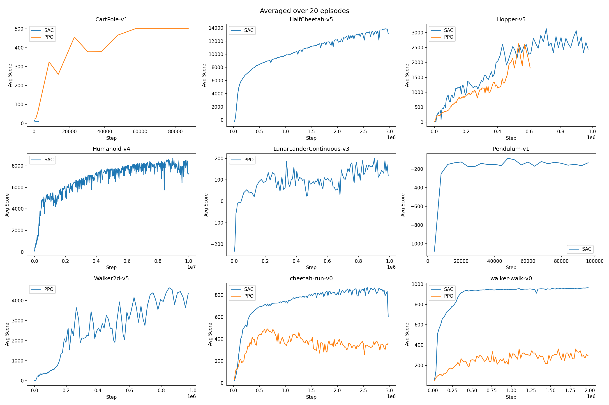
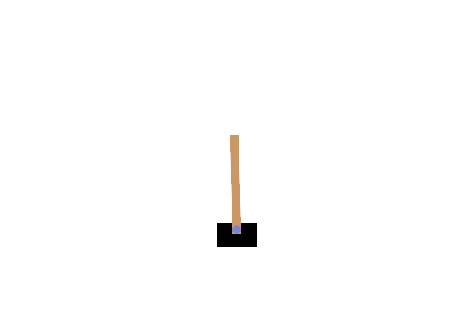
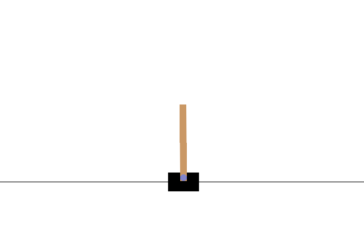

# 100LinesRL


Implementations of basic RL algorithms with minimal lines of codes! (PyTorch based)

Inspired by [minimalRL](https://github.com/seungeunrho/minimalRL).

## Algorithms

| Algorithm | Lines | Action Space | Vectorized Envs | CUDA | Supported Environments |
|:---------:|:-----:|:------------:|:---------------:|:----:|:----------------------|
| [PPO](https://github.com/jaehyun-jeong/100LinesRL/blob/master/ppo.py) | 100 | Discrete, Continuous | :white_check_mark: | :white_check_mark: | Classic Control, MuJoCo, DMControl |
| [SAC](https://github.com/jaehyun-jeong/100LinesRL/blob/master/sac.py) | 100 | Discrete, Continuous | :white_check_mark: | :white_check_mark: | Classic Control, MuJoCo, DMControl |
| [TD3](https://github.com/jaehyun-jeong/100LinesRL/blob/master/td3.py) | 100 | Continuous | :x: | :x: | Classic Control |
| [DQN](https://github.com/jaehyun-jeong/100LinesRL/blob/master/dqn.py) | 86 | Discrete | :x: | :x: | Classic Control |




| | Classic/CartPole-v1 | Classic/Pendulum-v1 | MuJoCo/HalfCheetah-v5 | MuJoCo/Hopper-v5 | MuJoCo/Walker2d-v5 | MuJoCo/Humanoid-v4 | DMC/cheetah-run-v0 | DMC/walker-walk-v0 |
|:---:|:---:|:---:|:---:|:---:|:---:|:---:|:---:|:---:|
| **SAC** |  |  |  |  | |  |  |  |
| **PPO** |  | | |  |  | |  |  |

## Dependencies
1. [PyTorch](https://pytorch.org/) >= 2.10.0
2. [Gymnasium](https://gymnasium.farama.org/) >= 1.2.3 (with `mujoco` extra for MuJoCo environments)
3. [NumPy](https://numpy.org/) >= 2.4.2
4. [Shimmy](https://shimmy.farama.org/) >= 2.0.0 (with `dm-control` extra for DeepMind Control Suite)
5. [tqdm](https://tqdm.github.io/) (for progress bar)

### Install
```bash
pip install -r requirements.txt
```

## Usage
```bash
# Works only with Python 3.
# e.g.
python3 dqn.py
python3 ppo.py --env "Hopper-v5"
python3 sac.py --env "dm_control/cheetah-run-v0"
python3 td3.py
```
